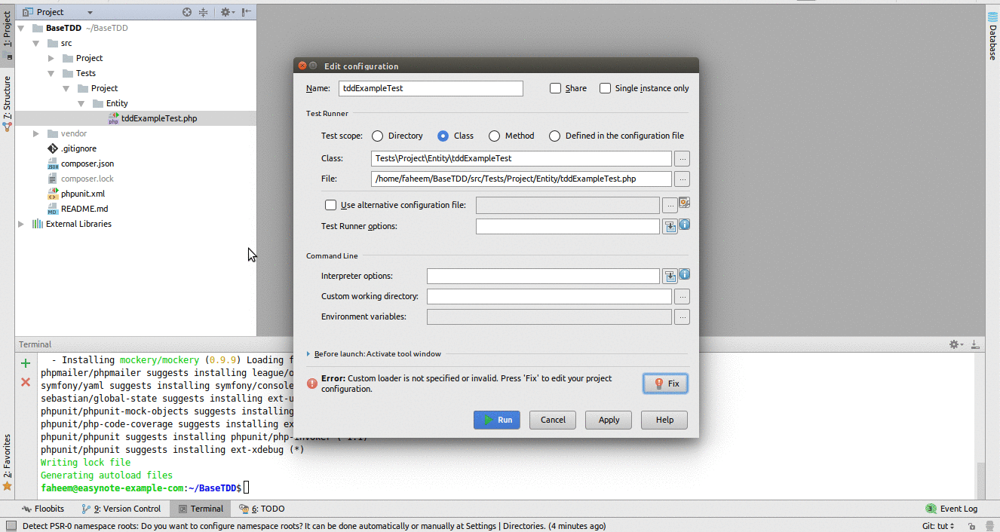

# BaseTDD
### Test Driven Development
#### In test-driven development, each new feature begins with writing a test.

## Why?
    * To write fully testable code
    * Avoid unwanted behaviour when changing code.
    * Easier to refactor.
    
### Before we start:

* Fork this repo and clone it to local.
* Basic knowledge of PHP OOP is a must.
* Having PHPStorm IDE will be a bonus.

## Set up:
* Install [PHPUnit](https://phpunit.de/getting-started.html)
* [Composer](https://getcomposer.org/doc/00-intro.md) Install in root folder.

### Looking at the test file:

Open the file `src/Tests/Project/Entity/tddExampleTest.php`.
You will find the following method in the class tddExampleTest.

```php
    /**
    *@test
    */
    public function sumOfNumbers()
    {
    $Class = new tddExample();
    $this->assertEquals($Class->addition(2,2),4);
    }
```

The above method is a simple test of method addition() in the class ttdExample. 
You can find tddExample class in the file `src/Project/Entity/tddExample.php`

## Testing:
Now to test if it is failing:
### PHPStorm
    1. Right click `/src/Tests` folder.
    2. Click run 'Tests'.
    3. In edit configuration click on the button Fix.
    4. Add the full path to `vendor/autoload.php` in Path to script.
    5. You will now be able to run your test.
    6. In future, click the green run/play button to run tests. 
    

### OR

### Command Line
`Run the command phpunit in the root of the repository.`


The test should be failing as seen in the graphic examples above.

## Passing the test.

### Assertions
In `src/Tests/Project/Entity/tddExampleTest.php` :

`$this->assertEquals($Class->addition(2,2),4);`
___

The above method call makes an assertion that the two given arguments are __EQUAL__ to each other.
You can pass this assertion by changing it too:

`$this->assertEquals(4,4);`

If you run your test you will see that the test has passed.
___

Now change it to: `$this->assertEquals(3,4);`

The test will now fail.
___
However the point of TDD is to make sure all methods that will be used in code are testable.

Change this line of code back to: `$this->assertEquals($Class->addition(2,2),4);`

## Making the test past in the easiest possible way.

__Being the evil programmer__

Whenever attempting to make a test pass, try do so in the most convenient way as possible.
In this case the easiest way possible to pass the test `public function sumOfNumbers()` is to return the number four in the method it is testing i.e  `addition()` in the class `tddExample` in the folder `src/Project/Entity/tddExample.php`. This is referred to being the evil programmer: using as little energy and passing the test as ___lazily___ as possible.

 ```php
 function addition()
 {
    return 4;
 }
 ```

Run phpunit in terminal or click the run button in PhpStorm.
You will see that the test are passing.

However this function will not be accurate if the numbers 3 and 5 are passed into it.

For this we create another test for it.

In `src/Tests/Project/Entity/tddExampleTest.php` :

Create a new test.

```php
     /**
     * @test
     */
    public function sumOfNumbersThreeAndFive()
    {
      $Class = new tddExample();
      $this->assertEquals($Class->addition(3,5) , 8);
    }
```

If you run your test you will see that a test has failed. You will get a message simalar to this:

___Failed asserting that 8 matches expected 4.___

In PhpStorm you can actually click on  `<Click to see difference>` and view the expected result and the actual result.

## Doing the work

So we have come to the point where the simplest possible is actually to return the sum of the two numbers:


```php
function addition($firstNumber, $secondNumber)
 {
    return $firstNumber + $secondNumber;
 }
 ```

Run your test and you should see two test and two assertions would have passed.

Specifications will dictate how many test are needed. What if the specifications of addition changes 10 years down the line to take in any amount of parameters that will be added?

`$this->assertEquals($Class->addition(3, 5, 2)`

OR

`$this->assertEquals($Class->addition(3, 5, 2, 8)`

__The Test:__

```php
    /**
     * @test
     */
    public function sumOfNumbersThreeAndFiveAndTwo()
    {
        $Class = new tddExample();
        $this->assertEquals($Class->addition(3, 5, 2) , 10);
    }
```

Run the testand you should see one test failing.

__The Solution__
```php
   function addition(...$Params)
    {
        return array_sum($Params);
    }
    ```
This is a very simple example but as you can see that even fundamental changes that can be made 10 years down the line, you will have the peace of mind knowing that previous specifications won't be altered in unwanted ways.

__When to stop:__

```php
    /**
     * @test
     */
    public function sumOfNumbersThreeAndFiveAndTwo()
    {
        $Class = new tddExample();
        $this->assertEquals($Class->addition(3, 5, 2, 8) , 18);
    }
```

If you write a test and it passes without having to make it pass, this test is invalid. Just take it out and move on :-).

## Try Out:

* TDD Kata from [osherove.com](http://osherove.com/tdd-kata-2/)
